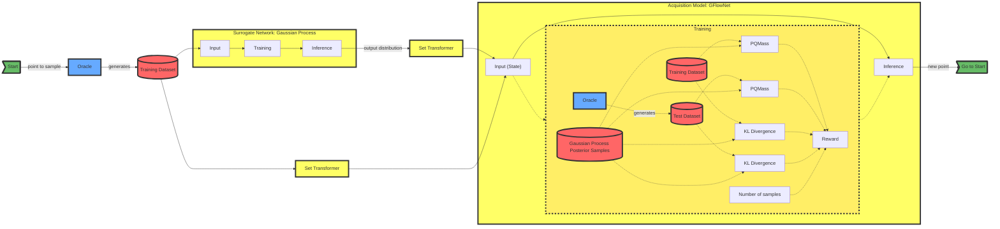

```mermaid
flowchart LR
    init>Start]
    oracle1[Oracle]
    oracle2[Oracle]
    train1[(Training Dataset)]
    train2[(Training Dataset)]
    test[(Test Dataset)]
    goto>Go to Start]

    st1[Set Transformer]
    st2[Set Transformer]

    subgraph gp[Surrogate Network: Gaussian Process]
        gp_input[Input]
        gp_train[Training]
        gp_inference[Inference]
        gp_input --> gp_train --> gp_inference
    end

    subgraph gfn[Acquisition Model: GFlowNet]
        gfn_input["Input (State)"]
        gfn_inference[Inference]

        gfn_input --> gfn_inference
        gfn_input -.-> gfn_training -.-> gfn_inference

        subgraph gfn_training[Training]
            direction LR

            gfn_gp_output[(Gaussian Process Posterior Samples)]
            pqm1[PQMass]
            pqm2[PQMass]
            kl1[KL Divergence]
            kl2[KL Divergence]
            n_samples[Number of samples]
            reward[Reward]

            train2 -.-> pqm1 & kl1
            oracle2 -.->|generates| test -.-> kl2 & pqm2
            gfn_gp_output -..-> pqm1 & kl1 & pqm2 & kl2

            pqm1 & pqm2 & kl1 & kl2 & n_samples -.-> reward
        end
    end


    init -->|point to sample| oracle1
    oracle1 -->|generates| train1 --> gp_input
    gp_inference -->|output distribution| st1 --> gfn_input
    train1 --> st2 ---> gfn_input
    gfn_inference -->|new point| goto

    classDef status fill:#6B6,stroke:#333,stroke-width:4px;
    classDef oracle fill:#6AF,stroke:#333,stroke-width:4px;
    classDef dataset fill:#F66,stroke:#333,stroke-width:4px;
    classDef module fill:#FF6,stroke:#333,stroke-width:4px;
    classDef submodule fill:#FE6,stroke:#333,stroke-width:4px,stroke-dasharray: 5;
    class init,loop,goto status
    class oracle1,oracle2,oracle3 oracle
    class train1,train2,test,gfn_gp_output dataset
    class gp,gfn,st1,st2 module
    class gfn_training submodule
```
